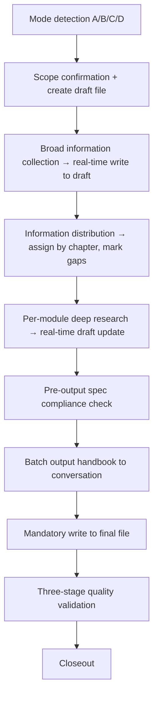

[English](README.md) | [中文](README.zh-CN.md)

# Global HR Compliance Playbook

[]()
[](LICENSE)
[](https://docs.claude.com/en/docs/claude-code)
[](README.md)

> Global HR Compliance & Operations Expert — A Claude Code Skill for generating country-specific employment compliance handbooks, querying local labor law details, and answering overseas HR practical questions.

This Skill encapsulates global employment compliance research as a reusable workflow: from scope confirmation and official-source retrieval, to authoritative-interpretation supplementation, per-chapter spec compliance, and three-stage quality validation. Every fact must be sourced; uncertainty is flagged explicitly. Output is suitable for direct use in enterprise internal management decisions.

## What It Does

This Skill consolidates frontline experience in overseas HR management and labor-relations practice across multinational enterprises, integrating handbook-compilation methodology accumulated from China, Japan, Singapore, the UAE, and other jurisdictions. Through anti-hallucination mechanisms — **mandatory source citation, explicit uncertainty degradation, and three-stage quality cross-validation (Structure pass → Content pass → Practice pass)** — it constrains AI output for accuracy and traceability, helping enterprise HR teams generate jurisdiction-specific compliance handbooks quickly and reliably.

Beyond full handbook generation (**Mode A**), the Skill also supports the following extended scenarios:

- **Quick Lookup (Mode B)**: For point-fact questions — minimum wage, overtime rates, probation period, social-security ratios, severance — it performs targeted retrieval against official sources and returns a concise answer with source links and effective dates;
- **Practice Q&A (Mode C)**: For scenario-based operational questions — how to terminate compliantly in Germany, how to assign expatriates to Singapore, how to execute large-scale layoffs in France — it returns an actionable plan structured as "Compliance steps + Risk points + Required documents";
- **Incremental Update (Mode D)**: For regulatory changes or partial revisions, it executes chapter-level diff updates against existing handbooks without regenerating the full document.

Output is consistently organized around "what enterprises do, when, by whom, and at what risk", covering recruitment access, work permits, visas/residence, compensation, personal income tax, social security and provident fund, employment contracts, termination and layoffs, leave, unions and employee handbook, data compliance, labor disputes, and forex/cross-border payments. It clearly distinguishes five rule tiers — **legal mandate / official enforcement practice / market convention / company discretion / requires professional review** — and addresses the differing rules applicable to local versus foreign employees separately, never blending them.

## Applicable Scenarios

Suitable for the following needs:

- Generating/drafting a complete employment compliance handbook for a country or region;
- Querying specific labor-law details (minimum wage, overtime, probation, severance, social-security ratios, etc.);
- Answering scenario-based overseas HR practice questions (compliant termination in Germany, expatriate assignments, large-scale layoffs in France);
- Reviewing, supplementing, or updating an existing handbook based on regulatory change.

Target users: multinational HR teams, expatriate project managers, global employment service providers, labor law consultants.

## Operating Modes (Mode Dispatch)

The Skill auto-detects the right mode for your request — **you don't pick manually**:

| Mode | Trigger | Workflow Depth | Output |
|:-----|:--------|:---------------|:-------|
| **A. Full Handbook** | "Generate a [country] employment compliance handbook" | Full 9-step workflow | 14-chapter handbook `.md` file |
| **B. Quick Lookup** | "What's the minimum wage in X" | Targeted search → concise answer | Direct answer + source links, no file |
| **C. Practice Q&A** | "How do we terminate compliantly in Germany" | Simplified multi-step | "Steps + Risks + Documents" answer, no file |
| **D. Incremental Update** | "Update the minimum wage section of the Korea handbook" | Diff workflow | Updates relevant chapters |

> Modes B/C don't require file creation, but **still enforce source citation, uncertainty flagging, and professional-review prompts**.

## Installation

### Prerequisites

- [Claude Code](https://docs.claude.com/en/docs/claude-code) or another Agent-Skills-compatible AI assistant installed.
- Git installed if cloning.
- Supported systems: Windows, macOS, Linux.

### Method 1: Clone to skills directory

```bash
# Linux / macOS
git clone https://github.com/AlexDou-Y/global-hr-compliance-playbook.git \
  ~/.claude/skills/global-hr-compliance-playbook
```

```powershell
# Windows PowerShell
git clone https://github.com/AlexDou-Y/global-hr-compliance-playbook.git `
  "$HOME\.claude\skills\global-hr-compliance-playbook"
```

### Method 2: Manual download

1. Download this repository as ZIP and extract.
2. Copy the entire `global-hr-compliance-playbook/` directory to the corresponding skills directory:

| AI Assistant | Linux / macOS | Windows |
|:---|:---|:---|
| Claude Code | `~/.claude/skills/` | `%USERPROFILE%\.claude\skills\` |

### Verify Installation

After restarting or refreshing Claude Code, type `/skills` and confirm `global-hr-compliance-playbook` appears in the list.

## Usage

Describe your need in natural language — the Skill picks the right mode automatically:

```text
Use global-hr-compliance-playbook. Please generate a Singapore employment
compliance handbook. Cover the differences between local and foreign employees;
all numbers (minimum wage, social-security ratios, overtime rates) must carry
official source citations. If no official source can be retrieved, use the
degradation prompt and add it to the "needs human verification" list.
```

To improve output quality, also provide:

- Country/region, including any special jurisdictions (e.g., UAE DIFC, California);
- Employee type (local, foreign, expatriate);
- Statutory employer and payroll entity;
- Existing internal policies, EOR agreements, or local-counsel input (if any);
- Issues of particular focus (termination flow, foreign work permits, cross-border data).

## Service Stance

This Skill serves enterprise internal management decisions and policy implementation.

It focuses on:

- The enterprise's compliance exposure and statutory obligations;
- Local mandatory labor rules, statutory minimum entitlements, and official enforcement positions;
- Cost and process impact across compensation, personal income tax, social security, and visas/work permits;
- Differences in applicable rules between foreign and local employees;
- High-risk, penalty-bearing, or contested matters.

It **does not provide final legal advice**. All high-risk, contested, or fact-specific matters are explicitly flagged for review by local counsel/tax/immigration advisors. Where uncertainty remains, the Skill uses degradation prompts rather than fabricating certainty.

## Workflow



1. **Mode detection**  
   Routes the request to A/B/C/D based on its characteristics, avoiding heavyweight workflow for simple queries.

2. **Scope confirmation + create draft file**  
   Confirm jurisdiction and chapter scope; immediately create `[country]_draft.md` in the skill's own directory as the single persistent carrier for the research process.

3. **Broad information collection → real-time write to draft**  
   Cast a wide net across official regulations and authoritative interpretations; each topic is written to the draft via the Edit tool the moment it's collected, never accumulated in conversation context.

4. **Information distribution**  
   Reorganize draft content by 14 chapters; mark gaps in each chapter.

5. **Per-module deep research**  
   Read the corresponding spec file (on demand, not pre-loaded), identify gaps against requirements, perform targeted supplementary searches, write to the draft, and mark each completed chapter ✅.

6. **Pre-output spec compliance check** (⚠️ Mandatory — cannot be skipped)  
   Verify each chapter against its spec for format, tables, mandatory questions, calculation examples, and risk warnings; missing items must be backfilled before formal output.

7. **Batch output handbook**  
   Output to the conversation in batches of 2-3 chapters following the spec format.

8. **Mandatory write to final file**  
   Use the Edit tool to batch-append into `[Country]_Employment_Compliance_Handbook_YYYYMMDD_Vx.x.md`, saved in the skill's own directory (relative path); read the file tail to verify completeness after writing.

9. **Three-stage quality validation**  
   Structure pass (numbering, headings, chapter completeness) → Content pass (gaps, tables, links) → Practice pass (numbers, steps, executability), each pass run independently.

## Handbook Structure

The full handbook follows a unified 14-chapter structure:

```text
Chapter 1   Preface (Scope, Version Notes)
Chapter 2   Country/Region Overview
Chapter 3   Recruitment
Chapter 4   Compensation
Chapter 5   Personal Income Tax
Chapter 6   Social Insurance & Provident Fund
Chapter 7   Employment Contract (incl. termination & severance)
Chapter 8   Leave & Time Off
Chapter 9   Unions & Employee Handbook
Chapter 10  Data Compliance
Chapter 11  Labor Disputes
Chapter 12  Foreign Exchange & Cross-Border Payments
Chapter 13  Risk Warnings
Chapter 14  Resources (links, templates, toolkits)
```

Each provision is structured in three layers: **Rules → Practice → Risk**:

- **Rules layer**: original legal text, statutory thresholds, official enforcement positions, with official source links;
- **Practice layer**: how the enterprise executes — required documents, responsible parties, operational steps;
- **Risk layer**: common pitfalls, consequences of non-compliance, prevention recommendations.

Every paragraph should contain at least one of: a specific number (amount, ratio, days, deadline), a specific operational step, a specific legal-clause citation, or a specific risk scenario.

## Source Discipline

Every fact must carry a source.

Source priority:

1. Government websites, official legal text, legal databases, official gazettes;
2. Official guidance from labor ministries, immigration, tax authorities, social-security agencies, regulators, courts, or labor-arbitration bodies;
3. Government FAQs, employer guides, wage orders, leave-entitlement pages, visa/work-permit pages;
4. Authoritative interpretations from top-tier law firms, Big Four accounting firms, and major consulting houses;
5. Professional media (e.g., Lexology), academic resources, industry reports — supporting only;
6. Model knowledge as last-resort fallback only.

**Banned**: anonymous wikis, pure marketing content, personal blogs, AI-generated content.

When no official source can be retrieved, the output must contain:

```text
⚠️ No official source retrieved — based on model knowledge, requires human verification.
```

Conflict handling: latest in-effect rule wins; official sources override non-official; among multiple official sources, the directly responsible authority wins; if still unresolved, flag with `⚠️ Conflicting interpretations — consult local counsel`.

## Anti-Hallucination Mechanism

Compliance handbooks have asymmetric error costs (one wrong severance rule can trigger litigation), so this Skill treats anti-hallucination as a **hard constraint**, not a guideline:

| Mechanism | Implementation |
|:----------|:---------------|
| **Source priority** | See "Source Discipline" above; anonymous wikis, personal blogs, and AI-generated content are explicitly banned |
| **Mandatory citations** | Every extracted fact must carry URL + retrieval timestamp; output principle #9: "no fabrication permitted" |
| **Explicit uncertainty** | Conflicting sources → `⚠️ Conflicting interpretations`; high-risk matters → flag for local counsel / tax / immigration review |
| **Degrade, don't go silent** | If tools fail: "⚠️ No official source retrieved — based on model knowledge, requires human verification". Silently using memory is forbidden |
| **No "from memory" output** | The Skill explicitly states "outputting from memory is failure mode #1"; spec must be re-read before drafting each chapter |
| **Persistent on disk** | Research is written to a draft file in real time, so auto-compact can't force you to reconstruct from impressions |
| **Rule-tier separation** | Legal mandate / official enforcement practice / market convention / company discretion / requires-professional-review — prevents "common practice" being dressed up as "the law" |

> Note: these are process constraints, not technical interception. The model can still err, so **a licensed local attorney must review before formal use** (see [Disclaimer](#disclaimer)).

## Directory Structure

```text
global-hr-compliance-playbook/
├── skill.md                    # Main entry (Claude loads this file)
├── README.md                   # This document (English)
├── README.zh-CN.md             # Chinese version
├── ARCHITECTURE.md             # Architecture documentation
├── CHANGELOG.md                # Version changelog
├── LICENSE                     # MIT License
├── 1_core/                     # Role, capabilities, output principles
├── 2_tools/                    # Tool configuration (Web Search strategy)
├── 3_workflow/                 # Workflow (research, quality validation, incremental update — 13 sub-flows)
├── 4_output/                   # Output specifications (format templates, terminology, chapter scale)
├── 5_spec/                     # Chapter specifications (14 chapters + mandatory questions + naming)
└── 6_meta/                     # Metadata
```

## Supported Countries/Regions

Theoretically supports any country/region; tested and verified:

- **East Asia**: Japan, South Korea, Hong Kong (China);
- **Southeast Asia**: Singapore, Malaysia, Indonesia, Vietnam, Thailand;
- **Middle East**: UAE (incl. DIFC), Saudi Arabia;
- **Europe & Americas**: USA (Federal & California), UK, Germany, France.

> Note: For regions where regulations change rapidly (e.g., the EU), manually verify the latest legislative status after handbook generation.

## Example Prompts

**Mode A — Full handbook generation**:

```text
Use global-hr-compliance-playbook. Generate a Singapore employment compliance
handbook. Focus on the differences between work pass categories (EP / S Pass / WP)
and their application processes. All minimum-wage, CPF ratios, and tax rates
must cite official MOM/IRAS/CPF Board sources.
```

**Mode B — Quick lookup**:

```text
What is South Korea's 2026 minimum wage? Cite the official source and effective date.
```

**Mode C — Practice consultation**:

```text
We need to terminate an employee in Germany who has worked 8 years (no-fault
termination). Please describe the compliance steps, required documents,
potential risks, and the calculation basis for severance.
```

**Mode D — Incremental update**:

```text
Based on UAE Federal Decree-Law No. 9 of 2024 (effective January 2026),
update the "Annual Leave" and "Sick Leave" sections of our existing UAE
handbook and flag the changes.
```

## Roadmap

- [x] English README (International Edition)
- [ ] Multi-language handbook output (English / 日本語 / 한국어)
- [ ] Integration with Claude Code Plugin Marketplace
- [ ] Chapter template visual preview

## Contributing

Issues and Pull Requests are welcome:

- **Report Issues**: regulatory errors, template defects, workflow improvement suggestions;
- **Add Countries**: contribute tested country handbooks as reference samples;
- **Improve Prompts**: optimize search strategies and quality-validation checklists.

Please read [CHANGELOG.md](CHANGELOG.md) before submitting PRs to understand version evolution.

## Disclaimer

Compliance handbooks generated by this Skill are **for reference only** and **do not constitute legal advice**. Labor laws vary widely across countries and change frequently. Before formal application:

1. Have local licensed attorneys or professional consulting firms review;
2. Monitor regulatory updates (validity periods are noted in handbooks);
3. Adjust execution details based on company-specific circumstances.

Authors and contributors assume no responsibility for any legal or business consequences arising from use of this tool.

## License

[MIT](LICENSE) © 2026

## Related Resources

- [Claude Code Official Documentation](https://docs.claude.com/en/docs/claude-code)
- [Anthropic Skills Repository](https://github.com/anthropics/skills)
- [Skill Development Guide](https://docs.claude.com/en/docs/claude-code/skills)

