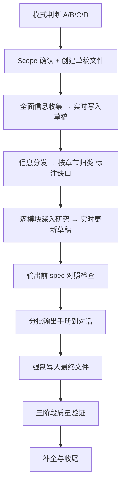

[English](README.md) | [中文](README.zh-CN.md)

# Global HR Compliance Playbook

[]()
[](LICENSE)
[](https://docs.claude.com/en/docs/claude-code)
[](README.md)

> 全球人力合规与运营专家 — 一个面向 Claude Code 的 Skill，用于生成各国/地区的用工合规手册、查询当地劳动法细节、解答海外 HR 实务问题。

这个 Skill 把全球用工合规研究沉淀为一套可复用工作流：从 Scope 确认、官方法规检索、权威解读补全、逐章 spec 对照，到三阶段质量验证，并强制要求所有事实标注来源、不确定时显式降级，输出可直接用于企业内部管理决策的合规手册。

## 它能做什么

这个 Skill 沉淀了跨国企业海外 HR 管理与劳动关系处理的一线经验，并融合中国、日本、新加坡、阿联酋等国家与地区人力合规用工手册的编制方法论；通过 **强制来源标注、不确定性显式降级、三阶段质量交叉验证（结构 pass → 内容 pass → 实务 pass）** 等反幻觉机制，约束 AI 输出的准确性与可追溯性，帮助企业 HR 快速、稳定地生成特定国家或地区的人力合规运营手册；基于实测，从零完成一份完整手册的端到端耗时约 50–60 分钟。

在完整手册生成（**模式 A**）之外，同样支持以下延伸场景：

- **法规快查（模式 B）**：针对单点事实问题——最低工资、加班费率、试用期、社保比例、解雇赔偿等——定向检索官方来源后给出简明答复，附原文链接与生效日期；
- **实务咨询（模式 C）**：针对场景化操作问题——如何在德国合规解雇、如何派驻员工至新加坡、如何在法国实施大规模裁员等——输出"合规步骤 + 风险点 + 所需文件"的可执行方案；
- **增量更新（模式 D）**：针对法规变更或局部修订需求，对已有手册执行章节级 diff 式更新，无需重新生成整本。

输出全程围绕"企业如何做、何时做、由谁做、有哪些风险"展开，覆盖招聘准入、工作许可、签证/居留、薪酬个税、社保公积金、劳动合同、解雇与裁员、假期休假、工会与员工手册、数据合规、劳动争议、外汇与跨境支付等议题；并明确区分 **法律强制 / 官方执法实践 / 市场惯例 / 企业自主 / 待专业复核** 五类规则层级，对外籍员工与本地员工的差异适用规则单独说明。

## 适用场景

适用于以下需求：

- 生成/编写某国家或地区的完整用工合规手册；
- 查询特定国家的劳动法细节（最低工资、加班费、试用期、解雇赔偿、社保比例等单点事实问题）；
- 解答场景化的海外 HR 实务问题（如何在德国合规解雇、如何派驻员工、如何在法国进行大规模裁员）；
- 对已有合规手册进行审查、补充或基于法规变更的增量更新。

适用对象：跨国公司 HR、外派项目经理、全球用工服务商、劳动法咨询从业者。

## 工作模式（Mode Dispatch）

Skill 会根据请求自动判断采用哪种模式，**用户无需手动指定**：

| 模式 | 触发场景 | 流程深度 | 输出 |
|:----|:--------|:--------|:-----|
| **A. 完整手册生成** | "做一份 [国家] 用工合规手册" | 完整 9 步 workflow | 14 章完整手册 `.md` 文件 |
| **B. 法规快查** | "X 国最低工资是多少" | 定向搜索 → 简明答复 | 直接答复 + 来源链接，不落盘 |
| **C. 实务咨询** | "如何在德国合规解雇某人" | 简化版多步流程 | "步骤 + 风险 + 文件"答复，不落盘 |
| **D. 增量更新** | "更新韩国手册的最低工资部分" | diff 流程 | 修改相关章节 |

> 模式 B/C 不强制创建文件，但**仍遵守来源标注、不确定性提示、专业复核提示**等核心约束。

## 安装

### 前置条件

- 已安装 [Claude Code](https://docs.claude.com/en/docs/claude-code) 或其他兼容 Agent Skills 的 AI 助手。
- 如采用 clone 方式安装，需要已安装 Git。
- 支持系统：Windows、macOS、Linux。

### 方式一：Clone 到 skills 目录

```bash
# Linux / macOS
git clone https://github.com/AlexDou-Y/global-hr-compliance-playbook.git \
  ~/.claude/skills/global-hr-compliance-playbook
```

```powershell
# Windows PowerShell
git clone https://github.com/AlexDou-Y/global-hr-compliance-playbook.git `
  "$HOME\.claude\skills\global-hr-compliance-playbook"
```

### 方式二：手动下载

1. 下载本仓库 ZIP 文件并解压。
2. 将整个 `global-hr-compliance-playbook/` 目录复制到对应 skills 目录：

| AI 助手 | Linux / macOS | Windows |
|:---|:---|:---|
| Claude Code | `~/.claude/skills/` | `%USERPROFILE%\.claude\skills\` |

### 验证安装

重启或刷新 Claude Code 后，输入 `/skills`，确认列表中能看到 `global-hr-compliance-playbook`。

## 使用方式

直接用自然语言描述需求，Skill 会自动识别模式：

```text
使用 global-hr-compliance-playbook，帮我生成一份新加坡的用工合规手册。
要求覆盖外籍员工与本地员工的差异，所有数字（最低工资、社保比例、加班费率）需要标注官方来源；
如无法找到官方来源，请使用降级提示并列入"需人工核实"项。
```

为提高输出质量，建议同时提供：

- 国家/地区，及是否涉及特殊司法管辖区（如阿联酋 DIFC、美国加州）；
- 员工类型（本地员工、外籍员工、派驻员工）；
- 法定雇主与发薪主体；
- 已有的内部政策、EOR 协议或当地律师反馈（如有）；
- 重点关注的议题（如解雇流程、外籍工签、数据跨境）。

## 服务立场

这个 Skill 服务于企业内部管理决策与制度落地。

它重点关注：

- 企业的合规暴露与法定义务；
- 当地强制性劳动规则、法定最低权益、官方执法口径；
- 薪酬、个税、社保、签证/工作许可的成本与流程影响；
- 外籍员工与本地员工适用规则的差异；
- 高风险、有处罚后果或存在分歧的事项。

它**不提供最终法律意见**。所有高风险、争议或个案判断事项会被显式标注为"需本地律师/税务/移民顾问复核"，并在不确定时使用降级提示而非伪造确定答案。

## 工作流



1. **模式判断**  
   按请求特征分流到 A/B/C/D，避免对简单问题启动重型流程。

2. **Scope 确认 + 创建草稿文件**  
   确认适用法域、章节范围；立即在 skill 同目录下创建 `[国家]_draft.md`，作为研究过程的唯一持久化载体。

3. **全面信息收集 → 实时写入草稿**  
   广撒网检索官方法规与权威解读；每完成一个主题立即用 Edit 工具写入草稿，不积累在对话 context 中。

4. **信息分发**  
   把草稿内容按 14 章归类，标注每章的信息缺口。

5. **逐模块深入研究**  
   读取对应 spec 文件（按需，不预加载），对照要求识别缺失，定向补充检索后写入草稿，每完成一章标记 ✅。

6. **输出前 spec 对照检查**（⚠️ 强制，不得跳过）  
   逐章对照 spec 检查格式、表格、必答问题、计算示例、风险提示，缺失项补齐再进入正式输出。

7. **分批输出手册**  
   按 spec 格式整理，每批 2-3 章输出到对话。

8. **强制写入最终文件**  
   用 Edit 工具分批追加写入 `[国家]用工合规手册_YYYYMMDD_Vx.x.md`，保存到 skill 同目录（相对路径），写完读取末尾验证完整性。

9. **三阶段质量验证**  
   结构 pass（编号、标题、章节齐全）→ 内容 pass（缺口、表格、链接）→ 实务 pass（数字、步骤、可执行性），每个 pass 独立运行。

## 手册结构

生成的完整手册采用统一 14 章结构：

```text
第1章  序言（适用范围、版本说明）
第2章  国家/地区概况
第3章  招聘
第4章  薪酬
第5章  个人所得税
第6章  社会保险与公积金
第7章  劳动合同（含合同解除与赔偿）
第8章  假期
第9章  工会与员工手册
第10章 数据合规
第11章 劳动争议
第12章 外汇与跨境支付
第13章 风险提醒
第14章 资料汇总（链接、模板、工具包）
```

每个条款按 **规则 → 实务 → 风险** 三层展开：

- **规则层**：法律条文原文、法定门槛、官方执法口径，附官方来源链接；
- **实务层**：企业如何执行、所需文件、责任主体、操作步骤；
- **风险层**：常见踩坑、违规后果、风险预防建议。

每段内容应至少包含以下之一：具体数字（金额、比例、天数、期限）、具体操作步骤、具体法律条款引用、具体风险场景。

## 来源纪律

每个事实都必须有来源支撑。

来源优先级：

1. 政府官网、官方法律文本、法律数据库、官方公报；
2. 劳工部、移民局、税务机关、社保机关、监管机构、法院或劳动仲裁机构的官方指南；
3. 政府 FAQ、雇主指南、工资令、假期权益页面、签证/工签页面；
4. 顶级律所、四大会计师事务所、知名咨询公司的权威解读；
5. 专业媒体（如 Lexology）、学术资源、行业报告，仅作为辅助；
6. 模型知识库只能作为最后兜底。

**禁止使用**：无作者百科、纯营销内容、个人博客、AI 生成内容。

如未检索到官方来源，输出必须包含：

```text
⚠️ 未检索到官方来源，以下基于模型知识库，需人工核实。
```

冲突处理：以最新有效规则为准；以官方来源为准；不同官方来源冲突时以直接主管机构口径为准；仍无法确认时标注 `⚠️ 存在口径分歧，建议咨询本地律师`。

## 防幻觉机制

合规手册的错误成本很高（一条错误的解雇赔偿规定可能导致诉讼），因此本 Skill 把反幻觉做成 **硬约束** 而非建议：

| 机制 | 具体做法 |
|:-----|:--------|
| **来源优先级** | 见上节"来源纪律"；明确禁用无作者百科、个人博客、AI 生成内容 |
| **强制标注来源** | 所有提取信息必须附 URL 和获取时间；输出准则第 9 条："严禁凭空捏造" |
| **不确定性显式化** | 来源冲突 → `⚠️ 存在口径分歧`；高风险事项 → 提示需本地律师/税务/移民顾问复核 |
| **降级而非沉默** | 工具不可用时标注"⚠️ 未检索到官方来源，以下基于模型知识库，需人工核实"，不允许偷偷用模型记忆冒充检索 |
| **反"凭记忆输出"** | Skill 明文写道"凭记忆输出是头号失败模式"，强制每章读 spec 后再写 |
| **持久化落盘** | 研究结果实时写入草稿文件，避免 auto-compact 后凭印象续写 |
| **规则层级区分** | 法律强制 / 官方执法实践 / 市场惯例 / 企业自主 / 待专业复核 — 防止把"通常这么做"伪装成法律要求 |

> 注意：这些是流程约束，不是技术拦截。模型仍可能犯错，**正式应用前必须由当地持牌律师复核**（见[免责声明](#免责声明)）。

## 目录结构

```text
global-hr-compliance-playbook/
├── skill.md                    # 主入口（Claude 加载的入口文件）
├── README.md                   # 英文版
├── README.zh-CN.md             # 本文档
├── ARCHITECTURE.md             # 架构说明
├── CHANGELOG.md                # 版本变更日志
├── LICENSE                     # MIT 许可证
├── 1_core/                     # 角色定位、能力、输出准则
├── 2_tools/                    # 工具配置（Web Search 策略）
├── 3_workflow/                 # 工作流（研究流程、质量校验、增量更新等 13 个子流程）
├── 4_output/                   # 输出规范（格式模板、术语标准、章节尺度）
├── 5_spec/                     # 章节规格（14 章详细要求 + 必答问题表 + 命名规范）
└── 6_meta/                     # 元信息
```

## 适用国家/地区

理论上支持任意国家/地区，已实测验证：

- **东亚**：日本、韩国、中国香港；
- **东南亚**：新加坡、马来西亚、印尼、越南、泰国；
- **中东**：阿联酋（含 DIFC）、沙特阿拉伯；
- **欧美**：美国（联邦及加州）、英国、德国、法国。

> 注：法规更新较快的地区（如欧盟），建议生成手册后人工复核最新立法动态。

## 示例 Prompt

**模式 A — 完整手册生成**：

```text
使用 global-hr-compliance-playbook，帮我生成一份新加坡的用工合规手册。
重点覆盖外籍员工的工作准证（EP / S Pass / WP）差异和申请流程。
所有最低工资、CPF 比例、税率请标注 MOM/IRAS/CPF Board 官方来源。
```

**模式 B — 法规快查**：

```text
韩国 2026 年最低工资标准是多少？请标注官方来源和生效日期。
```

**模式 C — 实务咨询**：

```text
我们要在德国解雇一名工作 8 年的员工（非过失性解雇），
请说明合规步骤、需要的文件、可能的风险，以及补偿金的计算口径。
```

**模式 D — 增量更新**：

```text
基于 2026 年 1 月生效的阿联酋 Federal Decree-Law No. 9 of 2024，
更新现有阿联酋手册的"年假"和"病假"两节，标注变更点。
```

## 路线图

- [x] 英文版 README（International Edition）
- [ ] 多语言手册输出支持（English / 日本語 / 한국어）
- [ ] 集成 Claude Code Plugin Marketplace
- [ ] 章节模板可视化预览

## 贡献

欢迎提交 Issue 和 Pull Request：

- **报告问题**：法规错误、模板缺陷、流程改进建议；
- **新增国家**：欢迎贡献已实测的国家手册作为参考样本；
- **改进 Prompt**：优化研究阶段的搜索策略、质量校验清单。

提交 PR 前请阅读 [CHANGELOG.md](CHANGELOG.md) 了解版本演进。

## 免责声明

本 Skill 生成的合规手册仅供参考，**不构成法律意见**。各国劳动法规复杂多变，正式应用前请：

1. 由当地持牌律师或专业咨询机构复核；
2. 关注法规更新（手册中标注的有效期）；
3. 结合企业实际情况调整执行细节。

作者及贡献者不对使用本工具产生的任何法律或商业后果承担责任。

## 许可证

[MIT](LICENSE) © 2026

## 相关资源

- [Claude Code 官方文档](https://docs.claude.com/en/docs/claude-code)
- [Anthropic Skills 仓库](https://github.com/anthropics/skills)
- [Skill 编写指南](https://docs.claude.com/en/docs/claude-code/skills)

